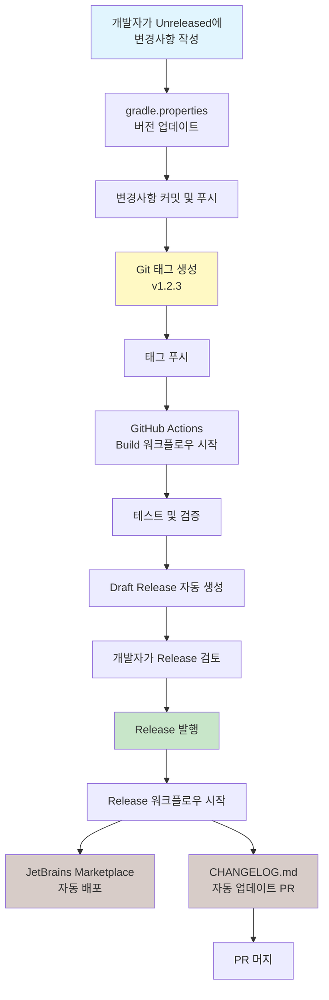

# 버전 업데이트 가이드 (Version Update Guide)

## 📋 목차 (Table of Contents)
1. [개요](#개요-overview)
2. [버전 관리 전략](#버전-관리-전략-versioning-strategy)
3. [단계별 가이드](#단계별-가이드-step-by-step-guide)
4. [체크리스트](#체크리스트-checklist)
5. [주의사항](#주의사항-important-notes)
6. [트러블슈팅](#트러블슈팅-troubleshooting)
7. [워크플로우 다이어그램](#워크플로우-다이어그램-workflow-diagram)

## 개요 (Overview)

JSONinja 프로젝트는 [Semantic Versioning](https://semver.org/)을 따르며, GitHub Actions를 통해 자동화된 릴리스 프로세스를 사용합니다.

### 버전 업데이트 프로세스 개요
1. **개발 단계**: `[Unreleased]` 섹션에 변경사항 작성
2. **준비 단계**: 버전 번호 업데이트
3. **릴리스 단계**: Git 태그 생성 및 푸시
4. **배포 단계**: GitHub Release 발행
5. **완료 단계**: CHANGELOG.md 자동 업데이트

## 버전 관리 전략 (Versioning Strategy)

### 버전 번호 형식
- **형식**: `MAJOR.MINOR.PATCH` (예: `1.2.3`)
- **태그 형식**: `vMAJOR.MINOR.PATCH` (예: `v1.2.3`)
  - ⚠️ **중요**: v1.2.0부터 태그에 `v` 접두사 사용

### 버전 증가 규칙
- **MAJOR**: 호환되지 않는 API 변경
- **MINOR**: 하위 호환성을 유지하면서 기능 추가
- **PATCH**: 하위 호환성을 유지하면서 버그 수정

## 단계별 가이드 (Step-by-Step Guide)

### 1단계: 개발 중 CHANGELOG 관리
```markdown
## [Unreleased]

### Added
- 새로운 기능 설명

### Changed
- 변경된 기능 설명

### Fixed
- 버그 수정 설명
```

**중요**: 
- 모든 변경사항은 `[Unreleased]` 섹션에 작성
- [Keep a Changelog](https://keepachangelog.com) 형식 준수
- 한국어/영어 혼용 가능

### 2단계: 버전 번호 업데이트
```bash
# gradle.properties 파일 수정
pluginVersion=1.2.3  # 새 버전 번호로 변경
```

### 3단계: 변경사항 커밋
```bash
git add gradle.properties
git commit -m "chore: prepare release v1.2.3"
git push origin main
```

### 4단계: Git 태그 생성 및 푸시
```bash
# 태그 생성 (v 접두사 필수!)
git tag v1.2.3

# 태그 푸시
git push origin v1.2.3
```

**⚠️ 주의**: 태그를 푸시하면 자동으로 빌드가 시작됩니다!

### 5단계: GitHub Release 발행
1. GitHub Actions의 "Build" 워크플로우가 완료될 때까지 대기
2. [Releases 페이지](https://github.com/buYoung/intellij-jsoninja/releases)로 이동
3. 자동 생성된 Draft Release 확인
4. Release notes 검토 (자동으로 `[Unreleased]` 내용이 포함됨)
5. "Publish release" 버튼 클릭

### 6단계: 자동화된 후속 작업
Release 발행 후 자동으로:
1. JetBrains Marketplace에 플러그인 배포
2. CHANGELOG.md 업데이트 PR 생성
3. `[Unreleased]` 섹션이 새 버전으로 이동

## 체크리스트 (Checklist)

### 릴리스 전 체크리스트
- [ ] 모든 변경사항이 `[Unreleased]` 섹션에 문서화되었는가?
- [ ] 버전 번호가 Semantic Versioning을 따르는가?
- [ ] 모든 테스트가 통과하는가?
- [ ] gradle.properties의 버전이 업데이트되었는가?
- [ ] 플러그인 호환성 범위가 적절한가? (`pluginSinceBuild`, `pluginUntilBuild`)

### 릴리스 후 체크리스트
- [ ] GitHub Release가 정상적으로 발행되었는가?
- [ ] CHANGELOG 업데이트 PR이 생성되었는가?
- [ ] JetBrains Marketplace에 배포되었는가?
- [ ] 플러그인이 정상적으로 설치/작동하는가?

## 주의사항 (Important Notes)

### ⚠️ 반드시 지켜야 할 사항
1. **태그 형식**: v1.2.0 이후부터는 반드시 `v` 접두사 사용
2. **CHANGELOG 위치**: `[Unreleased]` 섹션은 항상 최상단에 유지
3. **커밋 순서**: gradle.properties 변경 → 커밋 → 태그 생성
4. **브랜치**: main 브랜치에서만 릴리스 진행

### ❌ 하지 말아야 할 것
1. 수동으로 CHANGELOG.md의 버전 섹션 생성하지 않기
2. Release 발행 전에 태그 삭제하지 않기
3. gradle.properties와 태그의 버전 불일치
4. `[Unreleased]` 섹션을 비운 채로 릴리스하지 않기

## 트러블슈팅 (Troubleshooting)

### 문제: 빌드가 실패하는 경우
```bash
# 로컬에서 빌드 테스트
./gradlew clean build
./gradlew verifyPlugin
```

### 문제: 태그를 잘못 생성한 경우
```bash
# 로컬 태그 삭제
git tag -d v1.2.3

# 원격 태그 삭제 (주의!)
git push origin --delete v1.2.3
```

### 문제: CHANGELOG PR이 생성되지 않는 경우
- GitHub Actions의 release.yml 로그 확인
- GITHUB_TOKEN 권한 확인
- Release body가 비어있지 않은지 확인

### 문제: 버전 링크가 깨진 경우
```kotlin
// build.gradle.kts 확인
changelog {
    versionPrefix = "v"  // v1.2.0 이후 필수
}
```

## 워크플로우 다이어그램 (Workflow Diagram)



## 추가 리소스 (Additional Resources)

- [Semantic Versioning](https://semver.org/)
- [Keep a Changelog](https://keepachangelog.com)
- [GitHub Actions 문서](https://docs.github.com/en/actions)
- [IntelliJ Platform Plugin 문서](https://plugins.jetbrains.com/docs/intellij/)

---

*마지막 업데이트: 2025-07-29*